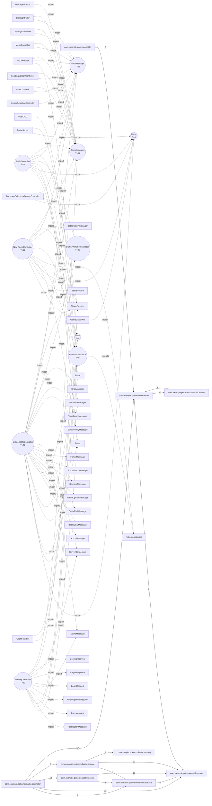

# Dependency Graph Visuals

Open this file in VS Code and use Markdown preview to render the graph.

```mermaid
%% Mermaid dependency visualization generated from DEPENDENCY_GRAPH.md
flowchart LR
  %% Package-level dependencies
  N774605934["com.example.pokemonbattle"]
  N330408748["com.example.pokemonbattle.controller"]
  N789767055["com.example.pokemonbattle.database"]
  N1827287169["com.example.pokemonbattle.model"]
  N227498478["com.example.pokemonbattle.security"]
  N551384827["com.example.pokemonbattle.server"]
  N2054806695["com.example.pokemonbattle.service"]
  N425168208["com.example.pokemonbattle.util"]
  N124784732["com.example.pokemonbattle.util.effects"]
  N330408748 -- "3" --> N789767055
  N330408748 -- "22" --> N1827287169
  N330408748 -- "19" --> N551384827
  N330408748 -- "3" --> N2054806695
  N330408748 -- "37" --> N425168208
  N789767055 -- "4" --> N1827287169
  N551384827 -- "4" --> N789767055
  N551384827 -- "10" --> N1827287169
  N2054806695 -- "2" --> N789767055
  N2054806695 -- "3" --> N1827287169
  N2054806695 -- "1" --> N227498478
  N124784732 -- "8" --> N425168208
  N425168208 -- "2" --> N1827287169
  N425168208 -- "17" --> N124784732
  N774605934 -- "2" --> N425168208

  %% Central classes and nearby dependencies
  N1613111039(("OnlineBattleController\nT=22"))
  N561970677(("BattleAnimationManager\nT=20"))
  N1109083777(("WaitingController\nT=13"))
  N209005655(("SceneManager\nT=11"))
  N502054316(("MusicManager\nT=11"))
  N240195410(("NewGameController\nT=11"))
  N1369060293(("PokemonInstance\nT=9"))
  N1022507652(("BattleController\nT=9"))
  N1839264840(("Move\nT=8"))
  N1615376438(("User\nT=8"))
  N1320263823["AvatarSelectionController"]
  N1320263823 -. "import" .-> N502054316
  N855980879["DatabaseManager"]
  N1022507652 -. "import" .-> N855980879
  N467972709["Battle"]
  N1022507652 -. "import" .-> N467972709
  N1022507652 -. "import" .-> N1839264840
  N1107830072["Player"]
  N1022507652 -. "import" .-> N1107830072
  N1022507652 -. "import" .-> N1369060293
  N1022507652 -. "import" .-> N561970677
  N1022507652 -. "import" .-> N502054316
  N506843339["PlayerSession"]
  N1022507652 -. "import" .-> N506843339
  N1022507652 -. "import" .-> N209005655
  N1161034832["IntroController"]
  N1161034832 -. "import" .-> N502054316
  N1161034832 -. "import" .-> N209005655
  N288779658["LoadingScreenController"]
  N288779658 -. "import" .-> N502054316
  N288779658 -. "import" .-> N209005655
  N152474817["MenuController"]
  N152474817 -. "import" .-> N502054316
  N152474817 -. "import" .-> N209005655
  N1275452907["GameDataDAO"]
  N240195410 -. "import" .-> N1275452907
  N1405150618["BattleRecord"]
  N240195410 -. "import" .-> N1405150618
  N240195410 -. "import" .-> N1839264840
  N240195410 -. "import" .-> N1107830072
  N240195410 -. "import" .-> N1369060293
  N58675428["PokemonSpecies"]
  N240195410 -. "import" .-> N58675428
  N240195410 -. "import" .-> N1615376438
  N477083946["BattleHistoryManager"]
  N240195410 -. "import" .-> N477083946
  N240195410 -. "import" .-> N502054316
  N240195410 -. "import" .-> N506843339
  N240195410 -. "import" .-> N209005655
  N1613111039 -. "import" .-> N855980879
  N1613111039 -. "import" .-> N467972709
  N1613111039 -. "import" .-> N1839264840
  N1613111039 -. "import" .-> N1107830072
  N1613111039 -. "import" .-> N1369060293
  N1613111039 -. "import" .-> N1615376438
  N1367682276["ActionMessage"]
  N1613111039 -. "import" .-> N1367682276
  N838092630["BattleChatMessage"]
  N1613111039 -. "import" .-> N838092630
  N314927671["BattleEndMessage"]
  N1613111039 -. "import" .-> N314927671
  N1340089781["BattleUpdateMessage"]
  N1613111039 -. "import" .-> N1340089781
  N313439103["DamageMessage"]
  N1613111039 -. "import" .-> N313439103
  N801632289["ForceSwitchMessage"]
  N1613111039 -. "import" .-> N801632289
  N147869579["ForfeitMessage"]
  N1613111039 -. "import" .-> N147869579
  N762805548["GameMessage"]
  N1613111039 -. "import" .-> N762805548
  N1039731104["ServerConnection"]
  N1613111039 -. "import" .-> N1039731104
  N587374359["SwitchNotifyMessage"]
  N1613111039 -. "import" .-> N587374359
  N1190212078["TurnReadyMessage"]
  N1613111039 -. "import" .-> N1190212078
  N1613111039 -. "import" .-> N561970677
  N678275263["ChatManager"]
  N1613111039 -. "import" .-> N678275263
  N1613111039 -. "import" .-> N502054316
  N1613111039 -. "import" .-> N506843339
  N1613111039 -. "import" .-> N209005655
  N1356242173["PokemonSelectionOverlayController"]
  N1356242173 -. "import" .-> N1839264840
  N1356242173 -. "import" .-> N1369060293
  N1356242173 -. "import" .-> N502054316
  N646751039["SettingsController"]
  N646751039 -. "import" .-> N502054316
  N646751039 -. "import" .-> N209005655
  N89874958["StartController"]
  N89874958 -. "import" .-> N502054316
  N89874958 -. "import" .-> N209005655
  N1109083777 -. "import" .-> N1107830072
  N1109083777 -. "import" .-> N1369060293
  N1109083777 -. "import" .-> N1615376438
  N2023178630["BattleStartMessage"]
  N1109083777 -. "import" .-> N2023178630
  N768139090["ErrorMessage"]
  N1109083777 -. "import" .-> N768139090
  N617833174["FindOpponentRequest"]
  N1109083777 -. "import" .-> N617833174
  N1109083777 -. "import" .-> N762805548
  N1755096635["LoginRequest"]
  N1109083777 -. "import" .-> N1755096635
  N454879899["LoginResponse"]
  N1109083777 -. "import" .-> N454879899
  N1109083777 -. "import" .-> N1039731104
  N851321306["ServerDiscovery"]
  N1109083777 -. "import" .-> N851321306
  N1109083777 -. "import" .-> N506843339
  N1109083777 -. "import" .-> N209005655
  N301438160["WcController"]
  N301438160 -. "import" .-> N1615376438
  N301438160 -. "import" .-> N502054316
  N301438160 -. "import" .-> N209005655
  N1275452907 -. "import" .-> N1839264840
  N937875730["UserDAO"]
  N937875730 -. "import" .-> N1615376438
  N496290426["HelloApplication"]
  N496290426 -. "import" .-> N209005655
  N1369060293 -. "extends" .-> N58675428
  N1146605018["BattleServer"]
  N1146605018 -. "import" .-> N1839264840
  N1146605018 -. "import" .-> N1369060293
  N861269184["ClientHandler"]
  N861269184 -. "import" .-> N1369060293
  N861269184 -. "import" .-> N1615376438
```
